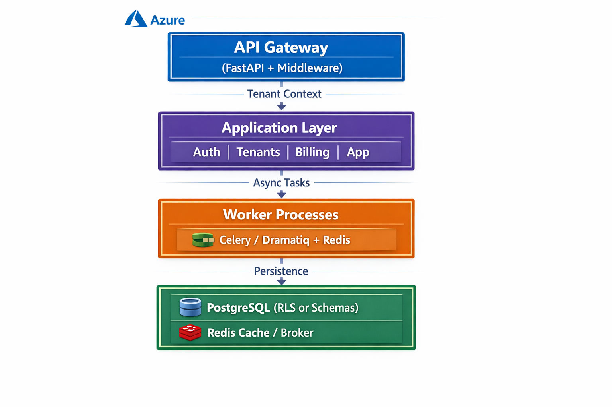
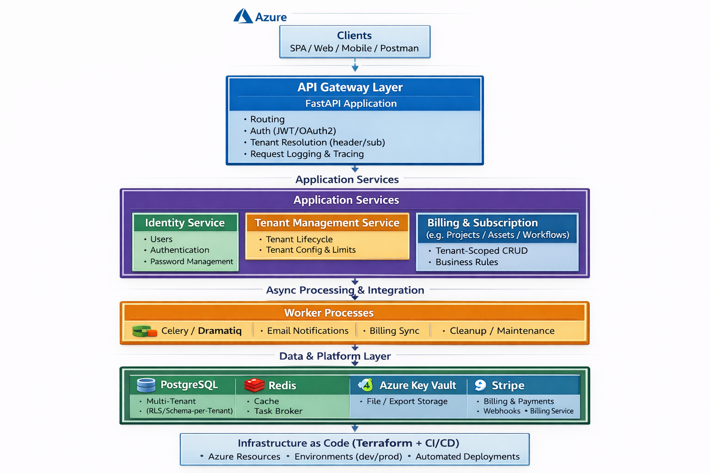

# SaaS Multi‑Tenant Platform Starter Kit (FastAPI + PostgreSQL + Terraform + Azure)

A production‑grade SaaS starter kit built with FastAPI, designed for engineering teams and consultants who need a secure, scalable, multi‑tenant foundation for B2B SaaS products.

This project demonstrates multi‑tenancy, RBAC, subscription billing, observability, and cloud‑native delivery — the core building blocks of modern SaaS platforms.

## 🚀 Features

### Multi‑Tenancy

- Tenant resolution via header or subdomain
- Schema‑per‑tenant or Row‑Level Security (RLS)
- Tenant lifecycle management (provisioning, activation, suspension)

### Identity & Access

- OAuth2 / JWT authentication
- Role‑based access control (RBAC)
- User invitation & onboarding flows
- Password hashing & secure session management

### Billing & Subscriptions

- Stripe integration (Checkout, Webhooks, Subscription lifecycle)
- Plan management (Free, Pro, Enterprise)
- Usage tracking hooks (extendable)

### Application Domain Example

- “Projects” module to demonstrate real tenant‑scoped data
- CRUD operations with full tenant isolation
- Audit logging for all actions

### Cloud‑Native Delivery

- Terraform IaC for Azure
- GitHub Actions CI/CD
- Azure Container Apps or AKS deployment
- Azure PostgreSQL, Redis, Key Vault, Storage

### Observability

- OpenTelemetry tracing
- Prometheus metrics
- Structured JSON logging
- Request correlation IDs

## 🏗️ Architecture

### Architecture Overview



```txt
┌──────────────────────────────┐
│        API Gateway           │
│  (FastAPI + Middleware)      │
└───────────────┬──────────────┘
                │ Tenant Context
┌───────────────▼─────────────────┐
│       Application Layer         │
│  Auth | Tenants | Billing | App │
└───────────────┬─────────────────┘
                │ Async Tasks
┌───────────────▼─────────────────┐
│       Worker Processes          │
│   Celery / Dramatiq + Redis     │
└───────────────┬─────────────────┘
                │ Persistence
┌───────────────▼─────────────────┐
│ PostgreSQL (RLS or Schemas)     │
│ Redis Cache / Broker            │
└─────────────────────────────────┘
```

### High-Level Architecture Diagram



```txt
                          ┌────────────────────────────────────┐
                          │            Clients                 │
                          │  SPA / Web / Mobile / Postman      │
                          └────────────────────────────────────┘
                                           │
                                           ▼
                          ┌────────────────────────────────────┐
                          │        API Gateway Layer           │
                          │        FastAPI Application         │
                          │  - Routing                         │
                          │  - Auth (JWT/OAuth2)               │
                          │  - Tenant Resolution (header/sub)  │
                          │  - Request Logging & Tracing       │
                          └────────────────────────────────────┘
                                           │
                                           ▼
                 ┌────────────────────────────────────────────────────┐
                 │              Application Services                  │
                 │                                                    │
                 │  ┌──────────────────────────────────────────────┐  │
                 │  │              Identity Service                │  │
                 │  │  - Users                                     │  │
                 │  │  - Authentication                            │  │
                 │  │  - Password Management                       │  │
                 │  └──────────────────────────────────────────────┘  │
                 │                                                    │
                 │  ┌──────────────────────────────────────────────┐  │
                 │  │           Tenant Management Service          │  │
                 │  │  - Tenant Lifecycle                          │  │
                 │  │  - Tenant Config & Limits                    │  │
                 │  └──────────────────────────────────────────────┘  │
                 │                                                    │
                 │  ┌──────────────────────────────────────────────┐  │
                 │  │           Billing & Subscription             │  │
                 │  │  - Plans & Pricing                           │  │
                 │  │  - Stripe Integration                        │  │
                 │  │  - Webhook Handling                          │  │
                 │  └──────────────────────────────────────────────┘  │
                 │                                                    │
                 │  ┌──────────────────────────────────────────────┐  │
                 │  │          Application Domain Service          │  │
                 │  │   (e.g., Projects / Assets / Workflows)      │  │
                 │  │  - Tenant-Scoped CRUD                        │  │
                 │  │  - Business Rules                            │  │
                 │  └──────────────────────────────────────────────┘  │
                 └────────────────────────────────────────────────────┘
                                           │
                                           ▼
                 ┌────────────────────────────────────────────────────┐
                 │            Async Processing & Integration          │
                 │                                                    │
                 │  ┌──────────────────────────────────────────────┐  │
                 │  │              Worker Processes                │  │
                 │  │  - Celery / Dramatiq                         │  │
                 │  │  - Email Notifications                       │  │
                 │  │  - Billing Sync                              │  │
                 │  │  - Cleanup / Maintenance                     │  │
                 │  └──────────────────────────────────────────────┘  │
                 │                                                    │
                 │  ┌──────────────────────────────────────────────┐  │
                 │  │               Message Broker                 │  │
                 │  │               (Redis / Queue)                │  │
                 │  └──────────────────────────────────────────────┘  │
                 └────────────────────────────────────────────────────┘
                                           │
                                           ▼
     ┌────────────────────────────────────────────────────────────────────────┐
     │                         Data & Platform Layer                          │
     │                                                                        │
     │  ┌───────────────────────────┐   ┌──────────────────────────────────┐  │
     │  │       PostgreSQL          │   │            Redis                 │  │
     │  │  - Multi-Tenant (RLS/     │   │  - Cache                         │  │
     │  │    Schema-per-Tenant)     │   │  - Task Broker                   │  │
     │  └───────────────────────────┘   └──────────────────────────────────┘  │
     │                                                                        │
     │  ┌───────────────────────────┐   ┌──────────────────────────────────┐  │
     │  │       Azure Key Vault     │   │        Azure Storage             │  │
     │  │  - JWT Signing Keys       │   │  - File / Export Storage         │  │
     │  │  - Secrets & Config       │   │                                  │  │
     │  └───────────────────────────┘   └──────────────────────────────────┘  │
     │                                                                        │
     │  ┌───────────────────────────┐   ┌──────────────────────────────────┐  │
     │  │   Observability Stack     │   │        Stripe (External)         │  │
     │  │  - OpenTelemetry          │   │  - Billing & Payments            │  │
     │  │  - Prometheus / Grafana   │   │  - Webhooks → Billing Service    │  │
     │  │  - Centralised Logging    │   └──────────────────────────────────┘  │
     │  └───────────────────────────┘                                         │
     └────────────────────────────────────────────────────────────────────────┘

                          ┌────────────────────────────────────┐
                          │      Infrastructure as Code        │
                          │         (Terraform + CI/CD)        │
                          │  - Azure Resources                 │
                          │  - Environments (dev/prod)         │
                          │  - Automated Deployments           │
                          └────────────────────────────────────┘
```

## 📁 Folder Structure

```txt
app/
  api/
    routes/
      auth.py
      tenants.py
      billing.py
      projects.py
    deps.py
  core/
    config.py
    security.py
    tenants.py
    logging.py
  db/
    session.py
    base.py
    migrations/
  models/
    tenant.py
    user.py
    role.py
    subscription.py
    project.py
  schemas/
    tenant.py
    user.py
    billing.py
    project.py
  services/
    auth_service.py
    tenant_service.py
    billing_service.py
    project_service.py
  workers/
    celery_app.py
    tasks/
      billing_tasks.py
      email_tasks.py
infra/
  terraform/
    main.tf
    variables.tf
    outputs.tf
    environments/
      dev/
      prod/
.github/
  workflows/
    ci.yml
    cd.yml
```

## Database Schema

[Database Schema Blueprint](./docs/database-schema.md)

[Alembic - schema migration engine setup & usage](./docs/alembic-usage.md)

## 🔐 Security

- JWT signing keys stored in Azure Key Vault
- Strong password hashing (bcrypt)
- Tenant isolation enforced at DB and service layer
- Audit logs for all sensitive actions
- Optional rate limiting

## 🧪 Testing

- Unit tests for services and utilities
- Integration tests for API endpoints
- E2E tests covering:
  - Register → Create Tenant → Subscribe → Create Project
- Load testing with Locust

## ☁️ Deployment

Local

```bash
docker-compose up --build
```

Cloud (Azure)

- Terraform provisions:
  - Azure Container Apps / AKS
  - Azure PostgreSQL
  - Azure Redis
  - Azure Key Vault
  - Azure Storage

GitHub Actions deploys on merge to `main`

[GitHub Actions & CI/CD explained](./docs/github-actions.md)

## 🗺️ Roadmap

- Custom domains per tenant
- Usage‑based billing
- Admin dashboard
- Email templates & workflows
- API rate limiting
- Multi‑region failover

## 🎯 Why This Project Exists

This starter kit demonstrates how to design and deliver a real, commercially viable SaaS platform using modern Python, cloud-native patterns, and enterprise-grade security.
